<h1 align=center>Easing & Timing PHP Functions</h1>

<div align="center"><pre>composer require smnandre/easing-functions</pre></div>
<div align="center">

[](https://github.com/smnandre/easing-functions/blob/main/composer.json)
[](https://github.com/smnandre/easing-functions/actions)
[](https://github.com/smnandre/easing-functions/releases)
[](https://github.com/smnandre/easing-functions/blob/main/LICENSE)
[](https://codecov.io/gh/smnandre/easing-functions)

</div>

---

**EasingFunctions** is a **PHP library** that provides a collection of easing functions commonly used in animations, transitions, and smooth interpolations.

It includes standard easing equations: quadratic, cubic, quartic, quintic, sine, exponential, circular, elastic, and bounce functions.

Each of them is available in three variations:
* **In**: The motion starts slowly and accelerates.
* **Out**: The motion starts quickly and decelerates.
* **InOut**: A combination of both, accelerating at the start and decelerating at the end.

## Easing Functions

| x       |                               In                               |                                Out                                |                                   InOut                                 |
|---------|:--------------------------------------------------------------:|:-----------------------------------------------------------------:|:-----------------------------------------------------------------------:|
| Cubic   |     <br> `easeInCubic`    |     <br> `easeOutCubic`    |     <br> `easeInOutCubic`    |
| Quart   |     <br> `easeInQuart`    |     <br> `easeOutQuart`    |     <br> `easeInOutQuart`    |
| Quad    |      <br> `easeInQuad`      |      <br> `easeOutQuad`      |      <br> `easeInOutQuad`      |
| Quint   |     <br> `easeInQuint`    |     <br> `easeOutQuint`    |     <br> `easeInOutQuint`    |
| Sine    |      <br> `easeInSine`      |      <br> `easeOutSine`      |      <br> `easeInOutSine`      |
| Expo    |      <br> `easeInExpo`      |      <br> `easeOutExpo`      |      <br> `easeInOutExpo`      |
| Circ    |      <br> `easeInCirc`      |      <br> `easeOutCirc`      |      <br> `easeInOutCirc`      |
| Back    |      <br> `easeInBack`      |      <br> `easeOutBack`      |      <br> `easeInOutBack`      |
| Bounce  |   <br> `easeInBounce`   |   <br> `easeOutBounce`   |   <br> `easeInOutBounce`   |
| Elastic |  <br> `easeInElastic` |  <br> `easeOutElastic` |  <br> `easeInOutElastic` |


## Installation

```shell
composer require smnandre/easing-functions
```

## Usage

```php
Easing\Functions::easeOutCubic(0);
// 0
Easing\Functions::easeOutCubic(0.5);
// 0.875

$values = array_map(Easing\Functions::easeOutCubic(...), range(0, 1, 0.1));
echo implode(" ", $values);
// 0 0.271 0.488 0.657 0.784 0.875 0.936 0.973 0.992 0.999 1
```

## Functions

### Easing Functions

| Name             | Formulae                                                 | Preview                                            |
|------------------|----------------------------------------------------------|----------------------------------------------------|
| `easeOutCubic`   | $`1 - pow(1 - x, 3)`$                                    |      |
| `easeInOutCubic` | $`x < 0.5 ? 4 * pow(x, 3) : 1 - pow(-2 * x + 2, 3) / 2`$ |  |
| `easeInQuart`    | $`pow(x, 4)`$                                            |        |
| `easeOutQuart`   | $`1 - pow(1 - x, 4)`$                                    |      |
| `easeInOutQuart` | $`x < 0.5 ? 8 * pow(x, 4) : 1 - pow(-2 * x + 2, 4) / 2`$ |  |
| `easeInCubic`    | $`pow(x, 3)`$                                            |        |
| `easeInQuad`     | $`x * x`$                                                |          |
| `easeOutQuad`    | $`1 - (1 - x) * (1 - x)`$                                |        |
| `easeInOutQuad`  | $`x < 0.5 ? 2 * x * x : 1 - pow(-2 * x + 2, 2) / 2`$     |    |
| `easeInQuint`    | $`pow(x, 5)`$                                            |        |   
| `easeOutQuint`   | $`1 - pow(1 - x, 5)`$                                    |      |
| `easeInOutQuint` | $`x < 0.5 ? 16 * pow(x, 5) : 1 - pow(-2 * x + 2, 5) / 2`$ |  |
| `easeInSine`     | $`1 - cos((x * pi()) / 2)`$                              |          |
| `easeOutSine`    | $`sin((x * pi()) / 2)`$                                  |        |
| `easeInOutSine`  | $`-(cos(pi() * x) - 1) / 2`$                            |    |
| `easeInExpo`     | $`x == 0 ? 0 : pow(2, 10 * x - 10)`$                    |          |
| `easeOutExpo`    | $`x == 1 ? 1 : 1 - pow(2, -10 * x)`$                    |        |
| `easeInOutExpo`  | $`x == 0 ? 0 : x == 1 ? 1 : x < 0.5 ? pow(2, 20 * x - 10) / 2 : (2 - pow(2, -20 * x + 10)) / 2`$ |  |
| `easeInCirc`     | $`1 - sqrt(1 - pow(x, 2))`$                             |          |
| `easeOutCirc`    | $`sqrt(1 - pow(x - 1, 2))`$                             |        |
| `easeInOutCirc`  | $`x < 0.5 ? (1 - sqrt(1 - pow(2 * x, 2))) / 2 : (sqrt(1 - pow(-2 * x + 2, 2)) + 1) / 2`$ |  |
| `easeInBack`     | $`2.70158 * pow(x, 3) - 1.70158 * pow(x, 2)`$           |          |
| `easeOutBack`    | $`1 + 2.70158 * pow(x - 1, 3) + 1.70158 * pow(x - 1, 2)`$ |        |
| `easeInOutBack`  | $`x < 0.5 ? (pow(2 * x, 2) * ((3.59258 * 2 * x) - 2.59258)) / 2 : (pow(2 * x - 2, 2) * ((3.59258 * (x * 2 - 2)) + 2.59258) + 2) / 2`$ |  |
| `easeInBounce`   | $`1 - easeOutBounce(1 - x)`$                            |      |
| `easeOutBounce`  | See `bounceOut` function                                 |    |
| `easeInOutBounce`| $`x < 0.5 ? (1 - easeOutBounce(1 - 2 * x)) / 2 : (1 + easeOutBounce(2 * x - 1)) / 2`$ |  |
| `easeInElastic`  | $`x == 0 ? 0 : x == 1 ? 1 : -pow(2, 10 * x - 10) * sin((x * 10 - 10.75) * ((2 * pi()) / 3))`$ |  |
| `easeOutElastic` | $`x == 0 ? 0 : x == 1 ? 1 : pow(2, -10 * x) * sin((x * 10 - 0.75) * ((2 * pi()) / 3)) + 1`$ |  |
| `easeInOutElastic`| $`x == 0 ? 0 : x == 1 ? 1 : x < 0.5 ? -(pow(2, 20 * x - 10) * sin((20 * x - 11.125) * ((2 * pi()) / 4.5))) / 2 : (pow(2, -20 * x + 10) * sin((20 * x - 11.125) * ((2 * pi()) / 4.5))) / 2 + 1`$ |  |

## License

This project is licensed under the MIT License. See the [LICENSE](./LICENSE) file for more information.
