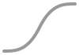
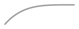
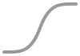

<h1 align=center>Easing & Timing Functions</h1>
<div align="center"><pre>composer require smnandre/easing-functions</pre></div>
<div align="center">

[](https://github.com/smnandre/easing-functions/blob/main/composer.json)
[](https://github.com/smnandre/easing-functions/actions)
[](https://github.com/smnandre/easing-functions/releases)
[](https://github.com/smnandre/easing-functions/blob/main/LICENSE)
[](https://codecov.io/gh/smnandre/easing-functions)

</div>

---

**EasingFunctions** is a **PHP library** that provides easing functions for animations, transitions, etc/

| x     |                            In                            |                               InOut                               |                             Out                             |
|-------|:--------------------------------------------------------:|:-----------------------------------------------------------------:|:-----------------------------------------------------------:|
| Cubic |  <br> `easeCubicIn` |  <br> `easeCubicInOut` |  <br> `easeCubicOut` |
| Quart |  <br> `easeQuartIn` |  <br> `easeQuartInOut` |  <br> `easeQuartOut` |
| Quad  |   <br> `easeQuadIn`   |   <br> `easeQuadInOut`   |   <br> `easeQuadOut`   |

## Installation

```shell
composer require smnandre/easing-functions
```

## Usage

```php
Easing\Functions::easeOutCubic(0);
// 0
Easing\Functions::easeOutCubic(0.5);
// 0.875

$values = array_map(Easing\Functions::easeOutCubic(...), range(0, 1, 0.1));
echo implode(" ", $values);
// 0 0.271 0.488 0.657 0.784 0.875 0.936 0.973 0.992 0.999 1
```

## Functions

### Easing Functions

| Name             | Formulae                                                 | Preview                                            |
|------------------|----------------------------------------------------------|----------------------------------------------------|
| `easeOutCubic`   | $`1 - pow(1 - x, 3)`$                                    |      |
| `easeInOutCubic` | $`x < 0.5 ? 4 * pow(x, 3) : 1 - pow(-2 * x + 2, 3) / 2`$ |  |
| `easeInQuart`    | $`pow(x, 4)`$                                            |        |
| `easeOutQuart`   | $`1 - pow(1 - x, 4)`$                                    |      |
| `easeInOutQuart` | $`x < 0.5 ? 8 * pow(x, 4) : 1 - pow(-2 * x + 2, 4) / 2`$ |  |
| `easeInCubic`    | $`pow(x, 3)`$                                            |        |
| `easeInQuad`     | $`x * x`$                                                |          |
| `easeOutQuad`    | $`1 - (1 - x) * (1 - x)`$                                |        |
| `easeInOutQuad`  | $`x < 0.5 ? 2 * x * x : 1 - pow(-2 * x + 2, 2) / 2`$     |    |

### Time Comparison

| Function   | 12.5% | 25%  | 37.5% | 50%   | 62.5% | 75%   | 87.5% | 
 |------------|-------|------|-------|-------|-------|-------|-------|
| OutQuart   | ██    | ███▎ | ████  | ████▌ | ████▊ | ████▊ | ████▊ |  
| OutCubic   | █▌    | ██▊  | ███▊  | ████▎ | ████▌ | ████▊ | ████▊ |  
| OutQuad    | █     | ██   | ███   | ███▊  | ████▎ | ████▌ | ████▊ |  
| InOutQuad  |       | ▌    | █▎    | ██▌   | ███▌  | ████▎ | ████▊ |  
| InOutCubic |       | ▎    | █     | ██▌   | ███▊  | ████▌ | ████▊ |  
| InOutQuart |       |      | ▊     | ██▌   | ████  | ████▊ | ████▊ |  
| InQuad     |       | ▎    | ▌     | █▎    | █▊    | ██▊   | ███▊  |  
| InCubic    |       |      | ▎     | ▌     | █     | ██    | ███▎  |  
| InQuart    |       |      |       | ▎     | ▊     | █▌    | ██▊   |  

## License

This project is licensed under the MIT License. See the [LICENSE](./LICENSE) file for more information.
